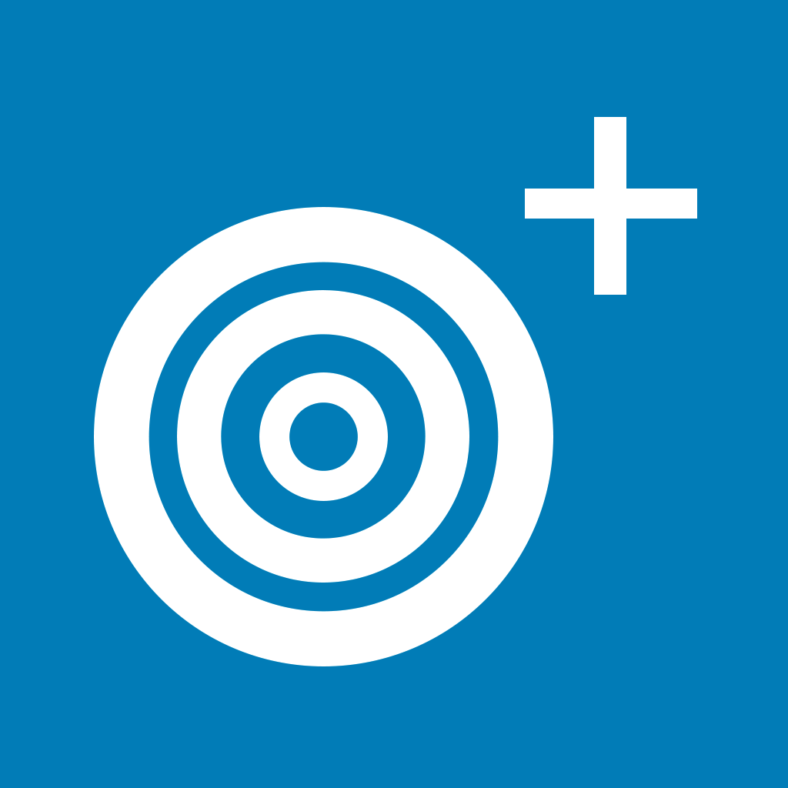

Goal Post
===================


[](https://developer.apple.com/iphone/index.action)
[](https://developer.apple.com/swift)
[](http://mit-license.org)
[]()

## Goal-Post
Get some photos 1 mi nearby from flickr
```
Make to do list app
Made with core data 
```
## Architecture

MVC (Model, View, Controller)

## Library Used

- 

## Preview

